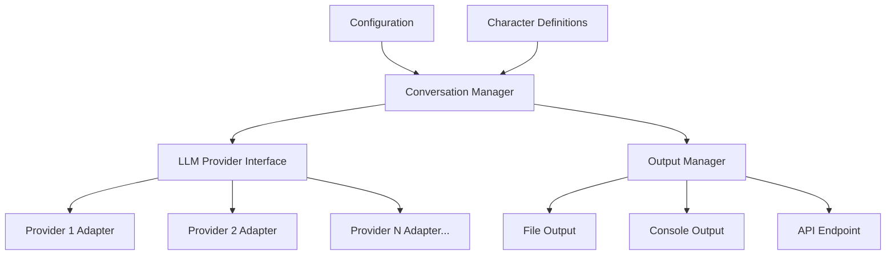
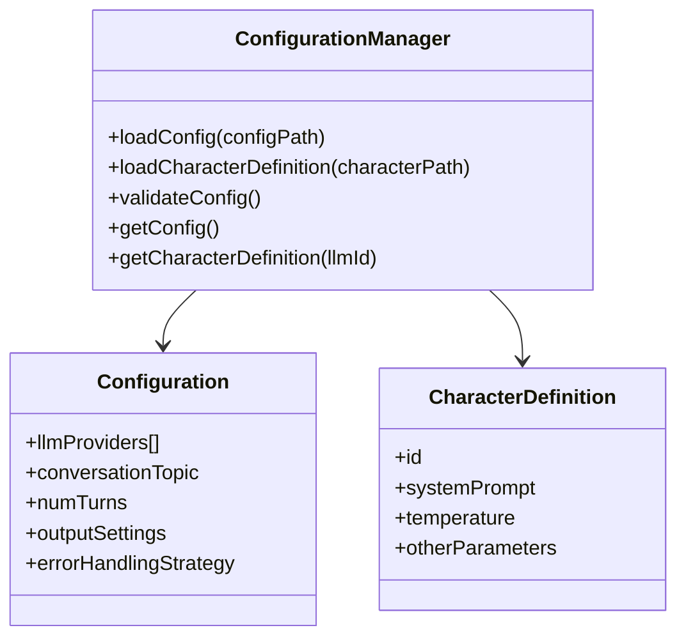
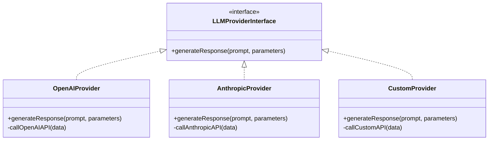
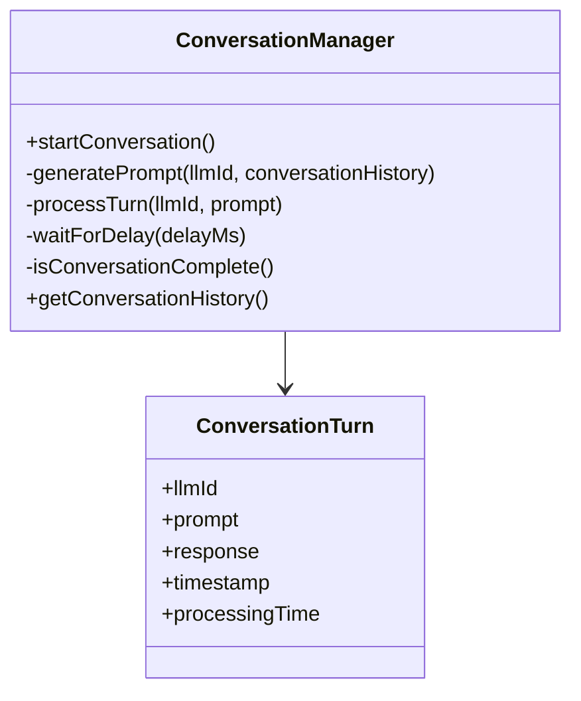
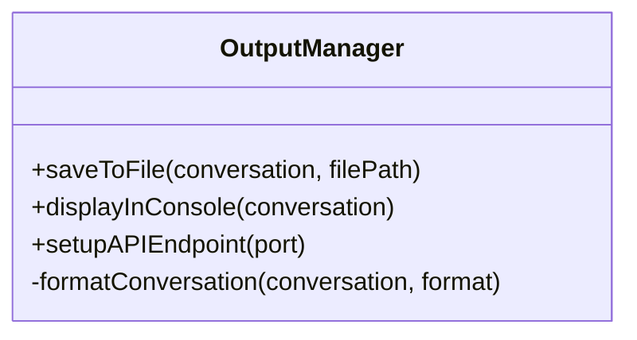
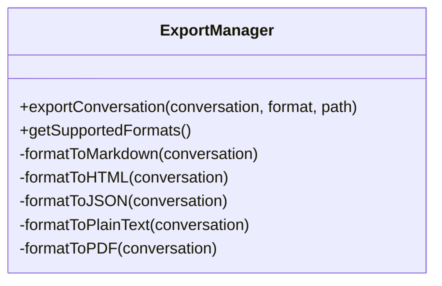
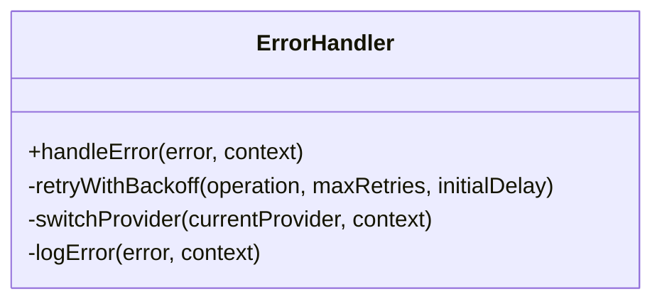
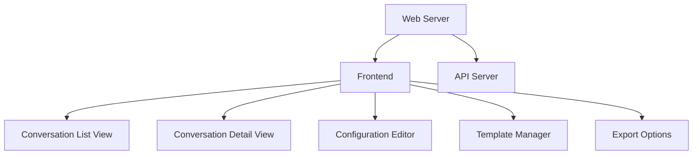

# LLM Conversation System - Detailed Plan

## System Overview

A modular Node.js system that enables two LLMs from different providers to have a turn-based conversation on a specified topic. The system is designed with flexibility in mind, allowing easy addition of new LLM providers.



## Core Components

### 1. Configuration Manager

This component will handle loading and validating the JSON configuration file and the separate character definition files.



### 2. LLM Provider Interface

A modular interface for different LLM providers, making it easy to add new providers.



### 3. Conversation Manager

Manages the turn-based conversation flow between the two LLMs.



### 4. Template Manager

Handles loading and applying conversation templates.

```mermaid
classDiagram
    class TemplateManager {
        +loadTemplate(templatePath)
        +applyTemplate(template, topic)
        +saveTemplate(template, path)
        +listTemplates()
    }
    
    class ConversationTemplate {
        +id
        +name
        +description
        +llmRoles[]
        +structure[]
        +initialPrompts{}
    }
    
    TemplateManager --> ConversationTemplate
```

### 5. Output Manager

Handles the different output methods: file, console, and API endpoint.



### 6. Export Manager

Handles exporting conversations in different formats.



### 7. Error Handler

Configurable error handling strategies for API communication issues.



### 8. Web Interface

A web interface for viewing and managing conversations.



## File Structure

```
llm-conversation-system/
├── config/
│   ├── config.json                # Main configuration file
│   ├── characters/                # Character definitions
│   │   ├── philosopher.json
│   │   ├── scientist.json
│   │   └── ...
│   ├── templates/                 # Conversation templates
│   │   ├── debate.json
│   │   ├── interview.json
│   │   └── ...
│   └── error-strategies/          # Error handling strategies
│       ├── retry.js
│       ├── fallback.js
│       └── ...
├── src/
│   ├── index.js                   # Entry point
│   ├── config-manager.js          # Configuration manager
│   ├── conversation-manager.js    # Conversation flow manager
│   ├── template-manager.js        # Template manager
│   ├── output-manager.js          # Output handling
│   ├── export-manager.js          # Export functionality
│   ├── error-handler.js           # Error handling
│   └── providers/                 # LLM providers
│       ├── provider-interface.js  # Common interface
│       ├── openai-provider.js     # OpenAI implementation
│       ├── anthropic-provider.js  # Anthropic implementation
│       └── ...                    # Other providers
├── output/                        # Saved conversations
│   └── ...
├── api/                           # API endpoint
│   └── server.js                  # Express server
├── web/                           # Web interface
│   ├── server.js                  # Web server
│   ├── public/                    # Static assets
│   └── src/                       # React components
│       ├── App.js
│       ├── components/
│       │   ├── ConversationList.js
│       │   ├── ConversationView.js
│       │   ├── ConfigEditor.js
│       │   └── ...
│       └── ...
├── package.json
└── README.md
```

## Configuration Structure

### Main Configuration (config.json)

```json
{
  "llmProviders": [
    {
      "id": "llm1",
      "provider": "openai",
      "model": "gpt-4",
      "apiKey": "YOUR_API_KEY",
      "characterDefinition": "philosopher.json"
    },
    {
      "id": "llm2",
      "provider": "anthropic",
      "model": "claude-2",
      "apiKey": "YOUR_API_KEY",
      "characterDefinition": "scientist.json"
    }
  ],
  "conversation": {
    "topic": "The future of artificial intelligence",
    "template": "philosophical-debate",  // Optional template to use
    "firstSpeaker": "llm1",
    "numTurns": 10,
    "delayBetweenTurns": 2000  // Delay in milliseconds between API calls
  },
  "output": {
    "saveToFile": true,
    "filePath": "./output/conversation.json",
    "displayInConsole": true,
    "exportFormat": "json",  // Default export format
    "api": {
      "enabled": true,
      "port": 3000
    },
    "web": {
      "enabled": true,
      "port": 8080
    }
  },
  "errorHandling": {
    "strategy": "retry",
    "maxRetries": 3,
    "initialDelay": 1000,
    "fallbackProvider": "openai"
  }
}
```

### Character Definition (e.g., philosopher.json)

```json
{
  "name": "Philosopher",
  "systemPrompt": "You are a thoughtful philosopher with a deep understanding of ethics, metaphysics, and epistemology. You analyze topics from first principles and consider their philosophical implications. You often reference philosophers like Kant, Aristotle, and Wittgenstein.",
  "parameters": {
    "temperature": 0.7,
    "maxTokens": 500
  }
}
```

### Conversation Template (e.g., debate.json)

```json
{
  "id": "philosophical-debate",
  "name": "Philosophical Debate",
  "description": "A structured philosophical debate on a given topic",
  "llmRoles": ["proposer", "critic"],
  "structure": [
    {"role": "proposer", "type": "opening", "instructions": "Present the main argument about {topic}"},
    {"role": "critic", "type": "rebuttal", "instructions": "Challenge the main argument about {topic}"},
    {"role": "proposer", "type": "defense", "instructions": "Defend your position on {topic}"},
    {"role": "critic", "type": "counter", "instructions": "Provide a counter-argument about {topic}"},
    {"role": "proposer", "type": "conclusion", "instructions": "Summarize your final position on {topic}"}
  ],
  "initialPrompts": {
    "proposer": "You are presenting a philosophical argument about {topic}. Start by clearly stating your position.",
    "critic": "You are critically examining arguments about {topic}. Look for logical fallacies and weak points."
  }
}
```

## Implementation Plan

### Phase 1: Core Infrastructure

1. Set up the Node.js project with necessary dependencies
2. Implement the Configuration Manager
3. Create the LLM Provider Interface and basic implementations for OpenAI and Anthropic
4. Implement basic error handling

### Phase 2: Conversation Logic and Templates

1. Implement the Conversation Manager
2. Create the Template Manager
3. Implement template loading and application
4. Create the prompt generation logic
5. Implement the turn-based conversation flow
6. Add conversation history tracking

### Phase 3: Output and Export Handling

1. Implement file output
2. Add console output formatting
3. Create the Export Manager
4. Implement different export formats
5. Create a simple API server with Express
6. Implement the API endpoints for retrieving and exporting conversations

### Phase 4: Web Interface

1. Set up the Express.js web server
2. Create the React frontend structure
3. Implement the conversation list and detail views
4. Add the configuration editor
5. Implement the template manager UI
6. Add real-time updates with Socket.IO
7. Implement export functionality in the UI

### Phase 5: Error Handling and Testing

1. Implement configurable error handling strategies
2. Add comprehensive logging
3. Create test cases for different scenarios
4. Test with different LLM providers
5. Test the web interface

### Phase 6: Documentation and Refinement

1. Write comprehensive documentation
2. Create example configurations, character definitions, and templates
3. Optimize performance
4. Add additional features based on testing feedback

## API Design

### Starting a Conversation

```javascript
// Example usage
const { ConversationSystem } = require('./src/index');

// Initialize the system with a configuration file
const system = new ConversationSystem('./config/config.json');

// Start the conversation
system.startConversation()
  .then(() => {
    console.log('Conversation completed successfully');
  })
  .catch(error => {
    console.error('Error during conversation:', error);
  });
```

### API Endpoints

The system will expose a RESTful API with the following endpoints:

```
// Conversation endpoints
GET /conversations - List all saved conversations
GET /conversations/:id - Get a specific conversation
POST /conversations - Start a new conversation with provided configuration
GET /conversations/current - Get the currently running conversation

// Template endpoints
GET /templates - List all available templates
GET /templates/:id - Get a specific template
POST /templates - Create a new template
PUT /templates/:id - Update a template
DELETE /templates/:id - Delete a template

// Export endpoints
GET /conversations/:id/export - Export a conversation in the specified format
```

## Web Interface Features

1. **Dashboard**: Overview of recent conversations and system status
2. **Conversation List**: Browse and search all conversations
3. **Conversation Viewer**: Read conversations with syntax highlighting and metadata
4. **Live Viewer**: Watch conversations happen in real-time
5. **Configuration Editor**: Edit the system configuration
6. **Template Manager**: Create and edit conversation templates
7. **Character Editor**: Create and edit LLM character definitions
8. **Export Panel**: Export conversations in different formats
9. **Settings**: Configure the web interface and system defaults

## Error Handling Strategies

The system will support multiple error handling strategies that can be configured:

1. **Retry Strategy**: Automatically retry failed API calls with exponential backoff
2. **Fallback Strategy**: Switch to an alternative provider if the primary one fails
3. **Logging Strategy**: Log errors and continue or abort based on configuration
4. **Hybrid Strategy**: Combine multiple strategies based on error type and context

## Delay Implementation

The system includes a configurable delay between API calls to help with rate limiting and create a more natural conversation rhythm:

```javascript
// Example implementation of the delay function
async waitForDelay(delayMs) {
  if (delayMs > 0) {
    console.log(`Waiting for ${delayMs}ms before next turn...`);
    return new Promise(resolve => setTimeout(resolve, delayMs));
  }
  return Promise.resolve();
}

// Usage in the conversation flow
async startConversation() {
  const { numTurns, delayBetweenTurns } = this.config.conversation;
  let currentSpeaker = this.config.conversation.firstSpeaker;
  
  for (let turn = 0; turn < numTurns; turn++) {
    // Process the current turn
    const prompt = this.generatePrompt(currentSpeaker, this.conversationHistory);
    await this.processTurn(currentSpeaker, prompt);
    
    // Switch speakers
    currentSpeaker = this.getNextSpeaker(currentSpeaker);
    
    // Wait for the configured delay before the next turn
    if (turn < numTurns - 1) {  // Don't delay after the last turn
      await this.waitForDelay(delayBetweenTurns);
    }
  }
  
  return this.conversationHistory;
}