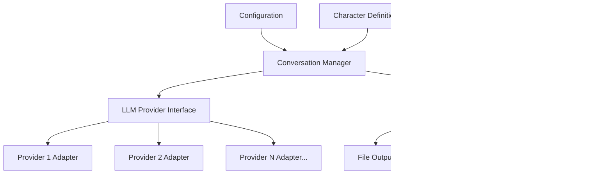
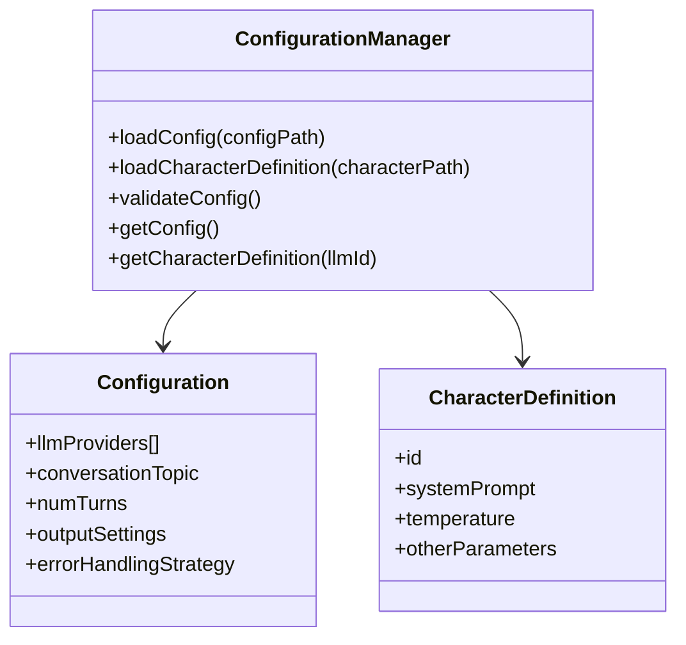
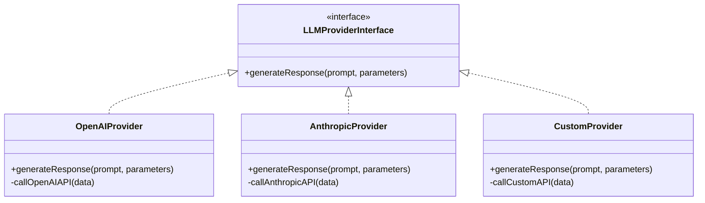
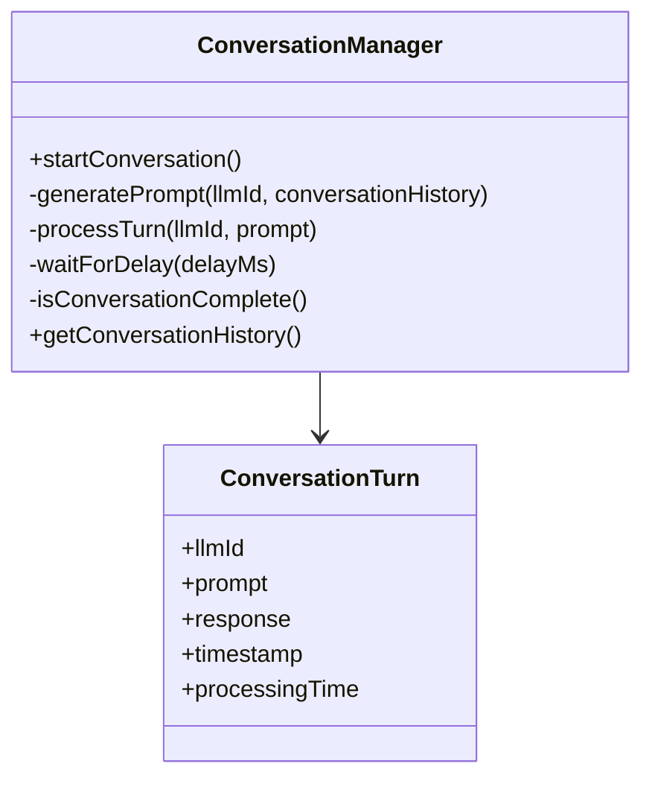
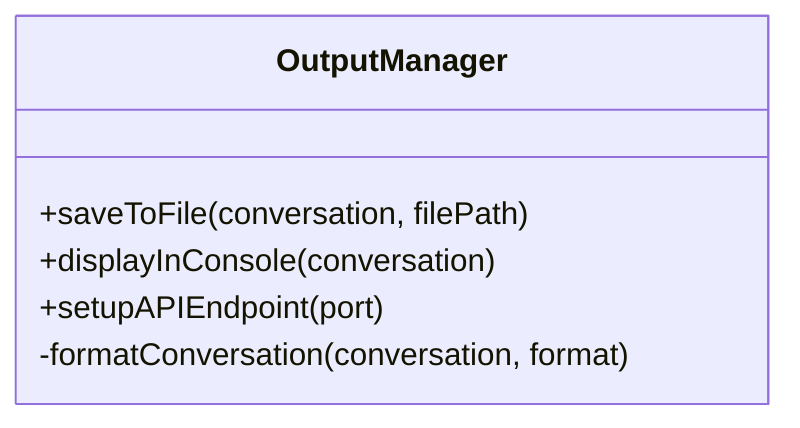
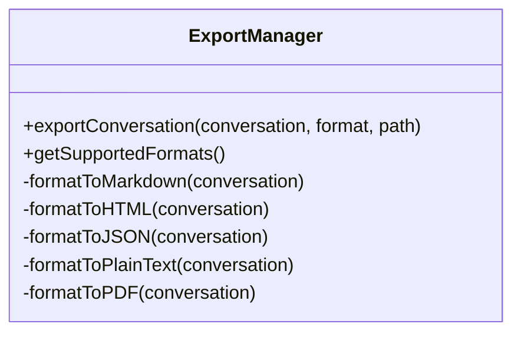
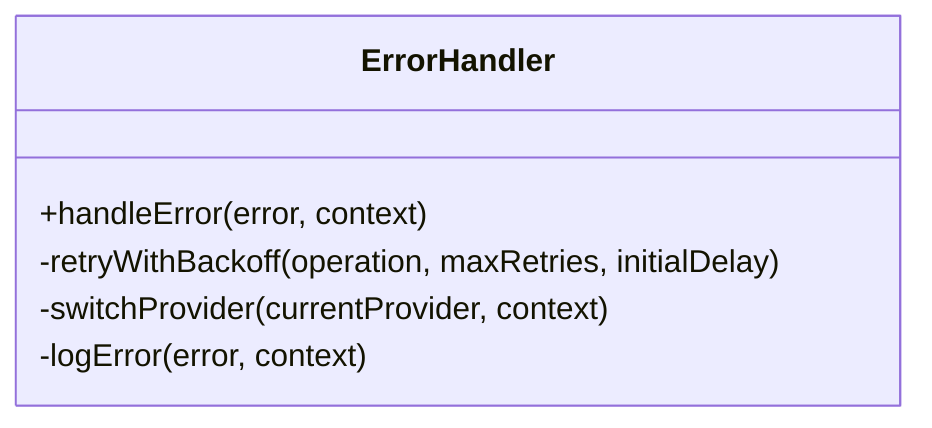
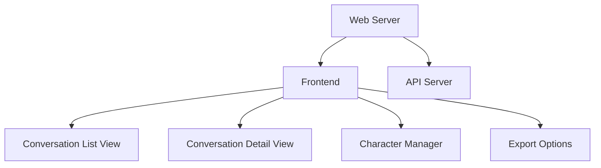

# LLM Conversation System - Detailed Plan

## System Overview

A modular Node.js system that enables two LLMs from different providers to have a turn-based conversation on a specified topic. The system is designed with flexibility in mind, allowing easy addition of new LLM providers.


```mermaid
graph TD
    A[Configuration] --> B[Conversation Manager]
    C[Character Definitions] --> B
    B --> D[LLM Provider Interface]
    D --> E[Provider 1 Adapter]
    D --> F[Provider 2 Adapter]
    D --> G[Provider N Adapter...]
    B --> H[Output Manager]
    H --> I[File Output]
    H --> J[Console Output]
    H --> K[API Endpoint]
```

## Core Components

### 1. Configuration Manager

This component will handle loading and validating the JSON configuration file and the separate character definition files.


```mermaid
classDiagram
    class ConfigurationManager {
        +loadConfig(configPath)
        +loadCharacterDefinition(characterPath)
        +validateConfig()
        +getConfig()
        +getCharacterDefinition(llmId)
    }
    
    class Configuration {
        +llmProviders[]
        +conversationTopic
        +numTurns
        +outputSettings
        +errorHandlingStrategy
    }
    
    class CharacterDefinition {
        +id
        +systemPrompt
        +temperature
        +otherParameters
    }
    
    ConfigurationManager --> Configuration
    ConfigurationManager --> CharacterDefinition
```

### 2. LLM Provider Interface

A modular interface for different LLM providers, making it easy to add new providers.


```mermaid
classDiagram
    class LLMProviderInterface {
        <<interface>>
        +generateResponse(prompt, parameters)
    }
    
    class OpenAIProvider {
        +generateResponse(prompt, parameters)
        -callOpenAIAPI(data)
    }
    
    class AnthropicProvider {
        +generateResponse(prompt, parameters)
        -callAnthropicAPI(data)
    }
    
    class CustomProvider {
        +generateResponse(prompt, parameters)
        -callCustomAPI(data)
    }
    
    LLMProviderInterface <|.. OpenAIProvider
    LLMProviderInterface <|.. AnthropicProvider
    LLMProviderInterface <|.. CustomProvider
```

### 3. Conversation Manager

Manages the turn-based conversation flow between the two LLMs.


```mermaid
classDiagram
    class ConversationManager {
        +startConversation()
        -generatePrompt(llmId, conversationHistory)
        -processTurn(llmId, prompt)
        -waitForDelay(delayMs)
        -isConversationComplete()
        +getConversationHistory()
    }
    
    class ConversationTurn {
        +llmId
        +prompt
        +response
        +timestamp
        +processingTime
    }
    
    ConversationManager --> ConversationTurn
```

### 4. Output Manager

Handles the different output methods: file, console, and API endpoint.


```mermaid
classDiagram
    class OutputManager {
        +saveToFile(conversation, filePath)
        +displayInConsole(conversation)
        +setupAPIEndpoint(port)
        -formatConversation(conversation, format)
    }
```

### 5. Export Manager

Handles exporting conversations in different formats.


```mermaid
classDiagram
    class ExportManager {
        +exportConversation(conversation, format, path)
        +getSupportedFormats()
        -formatToMarkdown(conversation)
        -formatToHTML(conversation)
        -formatToJSON(conversation)
        -formatToPlainText(conversation)
        -formatToPDF(conversation)
    }
```

### 6. Error Handler

Configurable error handling strategies for API communication issues.


```mermaid
classDiagram
    class ErrorHandler {
        +handleError(error, context)
        -retryWithBackoff(operation, maxRetries, initialDelay)
        -switchProvider(currentProvider, context)
        -logError(error, context)
    }
```

### 7. Web Interface

A web interface for viewing and managing conversations.


```mermaid
graph TD
    A[Web Server] --> B[Frontend]
    A --> C[API Server]
    B --> D[Conversation List View]
    B --> E[Conversation Detail View]
    B --> F[Character Manager]
    B --> G[Export Options]
```

## File Structure

```
llm-conversation-system/
├── config/
│   ├── config.json                # Main configuration file
│   ├── characters/                # Character definitions
│   │   ├── philosopher.json
│   │   ├── scientist.json
│   │   └── ...
│   └── error-strategies/          # Error handling strategies
│       ├── retry.js
│       ├── fallback.js
│       └── ...
├── src/
│   ├── index.js                   # Entry point / ConversationSystem class
│   ├── config-manager.js          # Configuration manager
│   ├── conversation-manager.js    # Conversation flow manager
│   ├── output-manager.js          # Output handling
│   ├── export-manager.js          # Export functionality
│   ├── error-handler.js           # Error handling
│   ├── conversation-repository.js # Conversation persistence
│   └── providers/                 # LLM providers
│       ├── provider-interface.js  # Common interface
│       ├── provider-factory.js    # Provider registry
│       ├── copilot-provider.js    # GitHub Copilot implementation
│       ├── openai-provider.js     # OpenAI implementation
│       └── anthropic-provider.js  # Anthropic implementation
├── output/                        # Saved conversations
│   └── conversations/
├── api/                           # Standalone API server
│   └── server.js
├── web/                           # Web interface
│   ├── server.js                  # Express + Socket.IO server
│   └── public/
│       └── index.html             # Single-page web UI
├── package.json
└── README.md
```

## Configuration Structure

### Main Configuration (config.json)

```json
{
  "llmProviders": [
    {
      "id": "philosopher",
      "provider": "copilot",
      "model": "gpt-4.1",
      "characterDefinition": "philosopher.json"
    },
    {
      "id": "scientist",
      "provider": "copilot",
      "model": "gpt-4.1",
      "characterDefinition": "scientist.json"
    }
  ],
  "conversation": {
    "topic": "The ethical implications of artificial intelligence",
    "firstSpeaker": "philosopher",
    "numTurns": 6,
    "delayBetweenTurns": 5000
  },
  "output": {
    "saveToFile": true,
    "directory": "./output/conversations",
    "filenameFormat": "{timestamp}_{topic}",
    "displayInConsole": true,
    "api": {
      "enabled": true,
      "port": 3001
    },
    "web": {
      "enabled": true,
      "port": 8080
    }
  },
  "errorHandling": {
    "strategy": "retry",
    "maxRetries": 3,
    "initialDelay": 1000,
    "fallbackProvider": "copilot"
  }
}
```

### Character Definition (e.g., philosopher.json)

```json
{
  "name": "Philosopher",
  "systemPrompt": "You are a thoughtful philosopher with a deep understanding of ethics, metaphysics, and epistemology...",
  "parameters": {
    "reasoningEffort": "high"
  }
}
```

The `parameters.reasoningEffort` field accepts `"low"`, `"medium"`, or `"high"` and is supported by the GitHub Copilot provider. Other parameters (e.g. `temperature`, `maxTokens`) are not supported by the Copilot provider and should be omitted.

## Implementation Plan

### Phase 1: Core Infrastructure

1. Set up the Node.js project with necessary dependencies
2. Implement the Configuration Manager
3. Create the LLM Provider Interface and basic implementations for OpenAI and Anthropic
4. Implement basic error handling

### Phase 2: Conversation Logic

1. Implement the Conversation Manager
2. Create the prompt generation logic
3. Implement the turn-based conversation flow
4. Add conversation history tracking

### Phase 3: Output and Export Handling

1. Implement file output
2. Add console output formatting
3. Create the Export Manager
4. Implement different export formats
5. Create a simple API server with Express
6. Implement the API endpoints for retrieving and exporting conversations

### Phase 4: Web Interface

1. Set up the Express.js web server with Socket.IO
2. Implement the conversation list and detail views
3. Add character CRUD management
4. Add real-time updates with Socket.IO
5. Implement export functionality in the UI

### Phase 5: Error Handling and Testing

1. Implement configurable error handling strategies
2. Add comprehensive logging
3. Create test cases for different scenarios
4. Test with different LLM providers
5. Test the web interface

### Phase 6: Documentation and Refinement

1. Write comprehensive documentation
2. Create example configurations, character definitions, and templates
3. Optimize performance
4. Add additional features based on testing feedback

## API Design

### Starting a Conversation

```javascript
// Example usage
const { ConversationSystem } = require('./src/index');

// Initialize the system with a configuration file
const system = new ConversationSystem('./config/config.json');

// Start the conversation
system.startConversation()
  .then(() => {
    console.log('Conversation completed successfully');
  })
  .catch(error => {
    console.error('Error during conversation:', error);
  });
```

### API Endpoints

The system will expose a RESTful API with the following endpoints:

```
// Conversation endpoints
GET /api/conversations - List all saved conversations
GET /api/conversations/:id - Get a specific conversation
POST /api/conversations - Start a new conversation with provided configuration
GET /api/conversations/current - Get the currently running conversation
DELETE /api/conversations/:id - Delete a conversation
GET /api/conversations/search?q=query - Search conversations

// Character endpoints
GET /api/characters - List all character definitions
GET /api/characters/:id - Get a specific character
POST /api/characters - Create a new character
PUT /api/characters/:id - Update a character
DELETE /api/characters/:id - Delete a character

// Export endpoints
GET /api/export/:id?format=json|text|markdown|html - Export a conversation
```

## Web Interface Features

1. **Conversation List**: Browse and search all conversations
2. **Conversation Viewer**: Read conversations with metadata
3. **New Conversation**: Start a conversation with custom topic, turns, delay, and character selection
4. **Character Manager**: Create, edit, and delete LLM character definitions (name, system prompt, reasoning effort)
5. **Export Panel**: Export conversations in JSON, Markdown, HTML, or plain text formats

## Error Handling Strategies

The system will support multiple error handling strategies that can be configured:

1. **Retry Strategy**: Automatically retry failed API calls with exponential backoff
2. **Fallback Strategy**: Switch to an alternative provider if the primary one fails
3. **Logging Strategy**: Log errors and continue or abort based on configuration
4. **Hybrid Strategy**: Combine multiple strategies based on error type and context

## Delay Implementation

The system includes a configurable delay between API calls to help with rate limiting and create a more natural conversation rhythm:

```javascript
// Example implementation of the delay function
async waitForDelay(delayMs) {
  if (delayMs > 0) {
    console.log(`Waiting for ${delayMs}ms before next turn...`);
    return new Promise(resolve => setTimeout(resolve, delayMs));
  }
  return Promise.resolve();
}

// Usage in the conversation flow
async startConversation() {
  const { numTurns, delayBetweenTurns } = this.config.conversation;
  let currentSpeaker = this.config.conversation.firstSpeaker;
  
  for (let turn = 0; turn < numTurns; turn++) {
    // Process the current turn
    const prompt = this.generatePrompt(currentSpeaker, this.conversationHistory);
    await this.processTurn(currentSpeaker, prompt);
    
    // Switch speakers
    currentSpeaker = this.getNextSpeaker(currentSpeaker);
    
    // Wait for the configured delay before the next turn
    if (turn < numTurns - 1) {  // Don't delay after the last turn
      await this.waitForDelay(delayBetweenTurns);
    }
  }
  
  return this.conversationHistory;
}