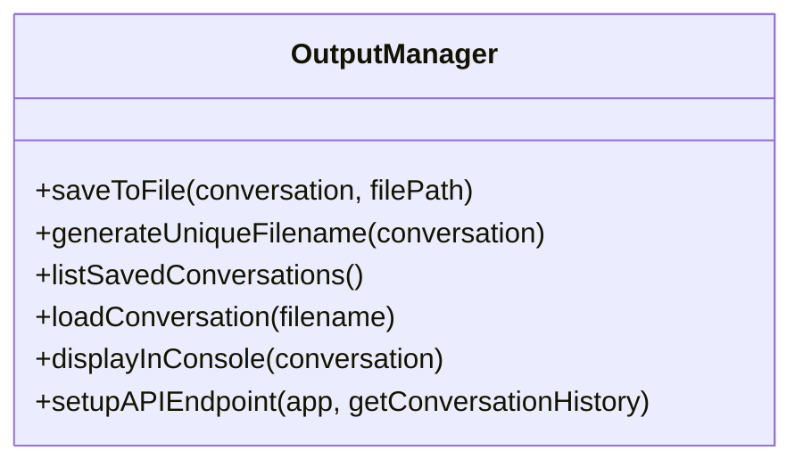
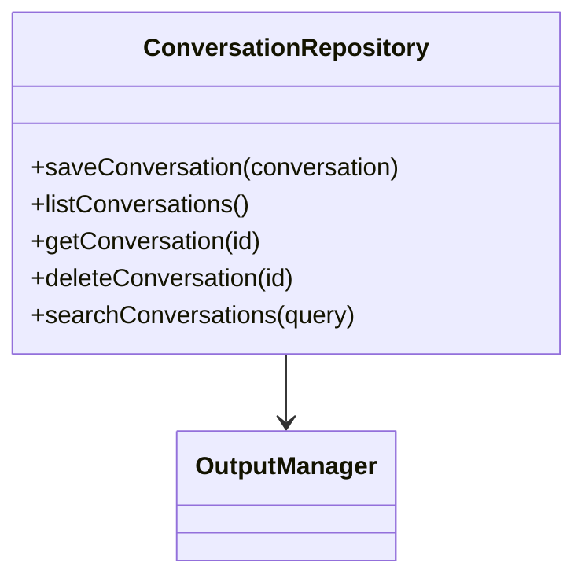
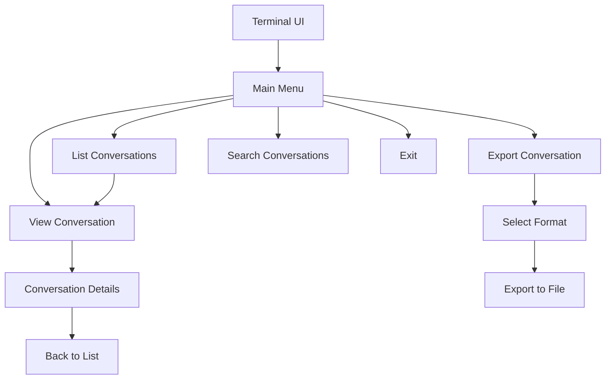

# Terminal UI Conversation System Plan

## Current System Overview

The current system:
- Saves all conversations to a single file (`./output/conversation.json`)
- Has a web-based UI using Bootstrap and Socket.IO
- Supports exporting conversations in different formats (JSON, text, Markdown, HTML)
- Has an API for retrieving and managing conversations

## Requirements

1. **Save each conversation in a separate file**
   - Each conversation should be saved as an individual file
   - Files should have unique identifiers (e.g., timestamp, UUID)
   - Maintain support for different export formats

2. **Create a modern terminal-based UI**
   - Develop a terminal UI to view all conversations
   - Use a modern aesthetic while maintaining terminal compatibility
   - Allow navigation between conversations
   - Support viewing conversation details

## Implementation Plan

### 1. Modify the Output Manager



Changes needed:
- Add a method to generate unique filenames based on conversation metadata
- Modify `saveToFile` to use these unique filenames by default
- Add methods to list saved conversations and load a specific conversation
- Update API endpoints to work with multiple conversation files

### 2. Create a Conversation Repository



This new component will:
- Manage the storage and retrieval of multiple conversation files
- Provide methods for listing, searching, and filtering conversations
- Handle metadata extraction and indexing

### 3. Develop the Terminal UI



The terminal UI will:
- Use a library like `blessed`, `ink`, or `cli-table3` for modern terminal UI elements
- Implement a navigation system with keyboard shortcuts
- Display conversations with syntax highlighting and formatting
- Support pagination for large lists of conversations

### 4. Update Configuration Structure

```json
{
  "output": {
    "saveToFile": true,
    "directory": "./output/conversations",
    "filenameFormat": "{timestamp}_{topic}",
    "displayInConsole": true,
    "api": {
      "enabled": true,
      "port": 3000
    },
    "web": {
      "enabled": false,
      "port": 8080
    },
    "terminal": {
      "enabled": true,
      "theme": "modern-dark",
      "colors": {
        "primary": "#36c5f0",
        "secondary": "#2eb67d",
        "accent": "#e01e5a",
        "background": "#1a1d21",
        "text": "#f2f3f5"
      }
    }
  }
}
```

### 5. Implement the Terminal UI Application

Create a new file `terminal-ui.js` that will:
- Parse command-line arguments
- Set up the terminal interface
- Connect to the conversation repository
- Handle user input and navigation
- Display conversations in a visually appealing way

## Technical Details

### File Structure for Conversations

Each conversation will be saved in a directory structure like:

```
output/
  conversations/
    2025-03-27_183015_ethical-implications-of-ai.json
    2025-03-27_190042_future-of-space-exploration.json
    ...
  index.json  # Metadata index of all conversations
```

The index file will contain:
```json
[
  {
    "id": "2025-03-27_183015",
    "filename": "2025-03-27_183015_ethical-implications-of-ai.json",
    "topic": "The ethical implications of artificial intelligence",
    "participants": ["philosopher", "scientist"],
    "turns": 6,
    "timestamp": "2025-03-27T18:30:15.000Z"
  },
  ...
]
```

### Terminal UI Design

The terminal UI will have a modern aesthetic with:
- Box-drawing characters for windows and panels
- Color-coded elements for different speakers
- Syntax highlighting for code blocks
- Keyboard shortcuts for navigation
- Progress indicators and spinners for loading
- Search functionality with highlighting

```
┌─────────────────────────────────────────────────────────────┐
│ LLM CONVERSATION SYSTEM                                     │
├─────────────────────────────────────────────────────────────┤
│ [1] 2025-03-27 18:30 │ The ethical implications of AI       │
│ [2] 2025-03-27 19:00 │ Future of space exploration          │
│ [3] 2025-03-27 20:15 │ Climate change solutions             │
├─────────────────────────────────────────────────────────────┤
│ Selected: The ethical implications of AI                    │
├─────────────────────────────────────────────────────────────┤
│ Turn 1: Philosopher                                         │
│                                                             │
│ The ethical implications of artificial intelligence are     │
│ profound and multifaceted. As we develop increasingly       │
│ sophisticated AI systems, we must grapple with questions    │
│ of autonomy, responsibility, and the potential for harm.    │
│                                                             │
│ Turn 2: Scientist                                           │
│                                                             │
│ I agree that the ethical dimensions are important, but we   │
│ must also consider the technical limitations of current     │
│ systems. Many concerns about AI are based on assumptions    │
│ about capabilities that may be decades away from reality.   │
├─────────────────────────────────────────────────────────────┤
│ [↑/↓] Navigate  [Enter] Select  [e] Export  [q] Quit        │
└─────────────────────────────────────────────────────────────┘
```

## Implementation Steps

1. **Update the OutputManager**
   - Modify the `saveToFile` method to generate unique filenames
   - Add methods for listing and loading conversations
   - Update the API endpoints

2. **Create the ConversationRepository**
   - Implement methods for saving, listing, and retrieving conversations
   - Create an indexing system for quick access to conversation metadata

3. **Develop the Terminal UI**
   - Set up the basic UI framework with navigation
   - Implement conversation listing and viewing
   - Add search and export functionality
   - Apply styling and color themes

4. **Update Configuration**
   - Add new configuration options for the terminal UI
   - Update the existing configuration handling

5. **Testing and Refinement**
   - Test with various conversation types and sizes
   - Refine the UI based on usability feedback
   - Ensure backward compatibility

## Dependencies

- `blessed` or `ink` for terminal UI components
- `cli-table3` for formatted tables
- `chalk` for terminal colors
- `inquirer` for interactive prompts
- `uuid` for generating unique identifiers

## Conclusion

This plan outlines a comprehensive approach to implementing the requested features. The changes will enhance the system by:

1. Providing better organization of conversations through individual files
2. Offering a modern terminal-based UI for viewing and managing conversations
3. Maintaining compatibility with the existing web interface and API